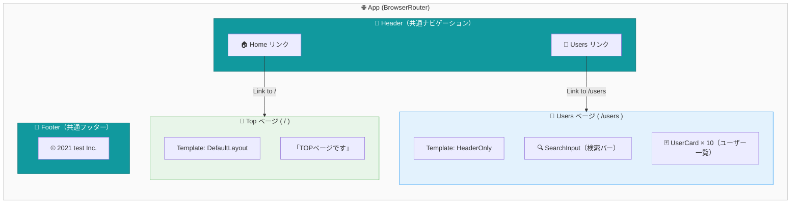
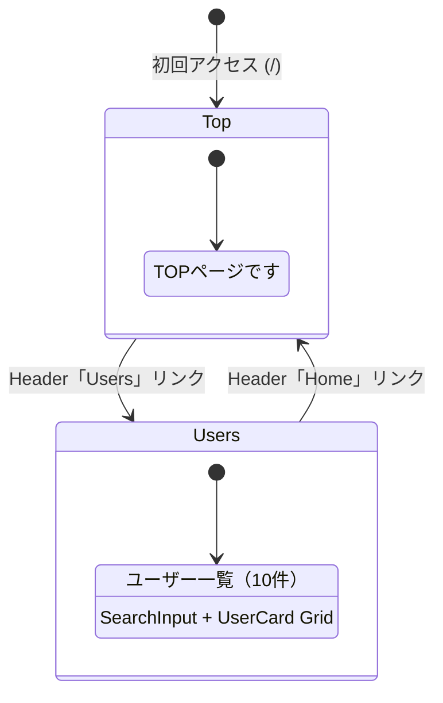

# 画面遷移図

## 概要



## ルート定義

| パス | ページ | テンプレート | 説明 |
|------|--------|-------------|------|
| `/` | `Top` | `DefaultLayout` | トップページ |
| `/users` | `Users` | `HeaderOnly` | ユーザー一覧ページ |

## 遷移フロー



## コンポーネント階層

```
App (BrowserRouter)
└── Router
    ├── / ─── DefaultLayout
    │         ├── Header
    │         │   ├── Link "Home" → /
    │         │   └── Link "Users" → /users
    │         ├── Top (ページコンテンツ)
    │         └── Footer
    │
    └── /users ─── HeaderOnly
                   ├── Header
                   │   ├── Link "Home" → /
                   │   └── Link "Users" → /users
                   ├── Users (ページコンテンツ)
                   │   ├── SearchInput
                   │   │   ├── Input
                   │   │   └── PrimaryButton "検索"
                   │   └── UserCard[] × 10
                   │       ├── UserIconWithName
                   │       └── Details (email, phone, company, website)
                   └── Footer
```

## ナビゲーション方式

- **実装方法**: `react-router-dom` の `<Link>` コンポーネント
- **ナビゲーション起点**: Header コンポーネントのみ
- **プログラム的遷移**: なし（`useNavigate` 未使用）
- **動的ルーティング**: なし（すべて静的パス）
